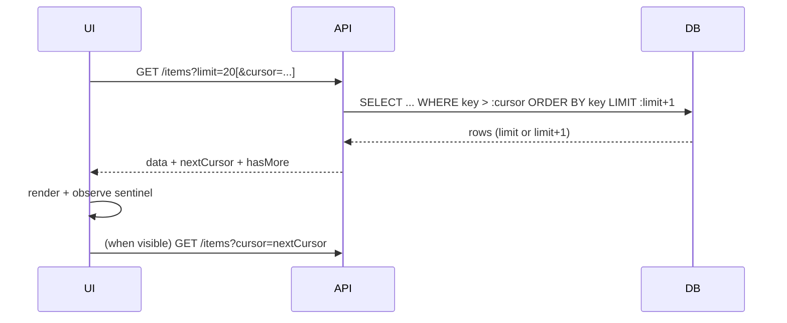

# ⚡ Pagination — A Practical Guide (Backend & Frontend)

> Keep your app fast, cheap, and friendly. This guide explains **when** and **how** to paginate, with **offset vs cursor** strategies, SQL & code examples (Spring Boot / Next.js), gotchas, indexing tips, API contracts, and a testing checklist you can paste into any project.

<p align="center">
  
  
  
  
</p>

---

## 🧭 Table of Contents
- [Why paginate?](#-why-paginate)
- [API response shapes](#-api-response-shapes)
- [Offset vs Cursor (Quick Decision)](#-offset-vs-cursor-quick-decision)
- [SQL & Indexing Cheatsheet](#-sql--indexing-cheatsheet)
- [Backend (Spring Boot)](#-backend-spring-boot)
- [Frontend (Next.js / React)](#-frontend-nextjs--react)
- [Sorting & Filtering](#-sorting--filtering)
- [Handling Inserts/Updates/Deletes](#-handling-insertsupdatesdeletes)
- [Counts: exact vs approximate](#-counts-exact-vs-approximate)
- [Caching, HTTP, and Links](#-caching-http-and-links)
- [Error Handling & Edge Cases](#-error-handling--edge-cases)
- [SEO & Accessibility](#-seo--accessibility)
- [Testing Checklist](#-testing-checklist)
- [cURL Examples](#-curl-examples)
- [TL;DR](#-tldr)

---

## 💡 Why paginate?
**Performance** — Don’t send thousands of rows per request.  
**Cost** — Less DB work, less bandwidth.  
**UX** — Faster first paint; users browse in small chunks.  
**Stability** — Predictable request/response sizes.  

> ✅ Always paginate on the **backend**. Client-side-only paging after downloading huge datasets defeats the purpose.

---

## 📦 API response shapes

### Link-style (offset-friendly)
```json
{
  "count": 35,
  "next": "/api/notes?page=2",
  "previous": null,
  "data": [
    {
      "id": 1,
      "collection_data": { "id": 2, "name": "test" },
      "title": "first note",
      "content": "notes",
      "collection": 2
    }
  ]
}
```

### Cursor-style
```json
{
  "data": [ /* ...items... */ ],
  "nextCursor": "eyJjcmVhdGVkQXQiOiIyMDI1LTEwLTE0VDA5OjAzOjE0WiIsImlkIjo0NjN9",
  "hasMore": true
}
```
> Return `hasMore` or `next/nextCursor`. If `hasMore=false` and `nextCursor=null`, you’re at the end.

---

## ⚖️ Offset vs Cursor (Quick Decision)
| Need | Choose |
|---|---|
| Classic paginator (page 1,2,3…), jump to page N | **Offset** |
| Infinite scroll / “Load more” | **Cursor** |
| Dataset receives inserts while browsing | **Cursor** |
| Arbitrary sorting (name, price, …) | **Offset** *(or compound keyset if feasible)* |
| Very deep pages (page 5,000) | **Cursor** |

> Rule of thumb: **Offset = simple & flexible. Cursor = fast at scale & stable under writes.**

---

## 🧰 SQL & Indexing Cheatsheet

### Offset (generic SQL)
```sql
SELECT *
FROM comments
ORDER BY id
LIMIT :limit OFFSET :offset;
```

### SQL Server (offset)
```sql
SELECT *
FROM comments
ORDER BY id
OFFSET @offset ROWS FETCH NEXT @limit ROWS ONLY;
```

### Cursor (single key)
```sql
SELECT *
FROM comments
WHERE id > :cursor
ORDER BY id ASC
LIMIT :limit;
```

### Cursor (created_at, id) with tie-break
```sql
SELECT *
FROM comments
WHERE (created_at, id) > (:cursorCreatedAt, :cursorId)
ORDER BY created_at ASC, id ASC
LIMIT :limit;
```

### SQL Server keyset (emulated tuple compare)
```sql
SELECT TOP (@limit) *
FROM comments
WHERE created_at > @cursorCreatedAt
   OR (created_at = @cursorCreatedAt AND id > @cursorId)
ORDER BY created_at ASC, id ASC;
```

### Indexes you *must* have
```sql
-- for offset pagination (ordering by id):
CREATE INDEX IF NOT EXISTS idx_comments_id ON comments(id);

-- for keyset on (created_at, id):
CREATE INDEX IF NOT EXISTS idx_comments_created_id ON comments(created_at, id);
```
> Prefer **covering indexes** for offset on large tables: paginate primary keys, then join to fetch full rows.

---

## 🖥️ Backend (Spring Boot)

### ✅ Offset with `Pageable`
```java
@GetMapping("/comments")
public Page<Comment> list(
    @RequestParam(defaultValue = "0") int page,
    @RequestParam(defaultValue = "20") int size,
    @RequestParam(defaultValue = "id,asc") String sort
) {
    String[] parts = sort.split(",");
    Sort s = Sort.by(Sort.Direction.fromString(parts[1]), parts[0]);
    Pageable pageable = PageRequest.of(page, size, s);
    return commentRepository.findAll(pageable);
}
```

**Recommended response shape adapter**
```java
record PageResponse<T>(List<T> data, int page, int limit, long count, String next, String previous) {}

PageResponse<CommentDto> toResponse(Page<Comment> p, int page, int limit, String sort) {
    String base = "/api/comments?limit=" + limit + "&sort=" + sort + "&page=";
    String next = p.hasNext() ? base + (page + 1) : null;
    String prev = p.hasPrevious() ? base + (page - 1) : null;
    return new PageResponse<>(p.getContent().stream().map(this::toDto).toList(),
            page, limit, p.getTotalElements(), next, prev);
}
```

### ⚡ Cursor (keyset) with `(created_at, id)`
```java
@GetMapping("/comments")
public CursorResponse<CommentDto> list(
    @RequestParam(required = false) String cursor,
    @RequestParam(defaultValue = "20") int limit
) {
    Instant createdAt = Instant.EPOCH;
    long id = 0L;

    if (cursor != null) {
        var c = cursorCodec.decode(cursor); // {createdAt, id}
        createdAt = c.createdAt();
        id = c.id();
    }

    // fetch limit+1 to check "hasMore"
    var rows = repo.findNext(createdAt, id, PageRequest.of(0, limit + 1, Sort.by("createdAt").ascending().and(Sort.by("id").ascending())));

    boolean hasMore = rows.size() > limit;
    var page = hasMore ? rows.subList(0, limit) : rows;

    String nextCursor = hasMore
        ? cursorCodec.encode(page.get(page.size() - 1).getCreatedAt(),
                             page.get(page.size() - 1).getId())
        : null;

    return new CursorResponse<>(page.stream().map(this::toDto).toList(), nextCursor, hasMore);
}
```

**Repository (JPQL)**
```java
@Query("SELECT c FROM Comment c WHERE (c.createdAt > :createdAt) OR (c.createdAt = :createdAt AND c.id > :id) ORDER BY c.createdAt ASC, c.id ASC")
List<Comment> findNext(@Param("createdAt") Instant createdAt,
                       @Param("id") Long id,
                       Pageable pageable);
```

**Opaque cursor codec (base64 JSON)**
```java
record Cursor(Instant createdAt, long id) {}

class CursorCodec {
  String encode(Instant createdAt, long id) {
    String json = String.format("{"createdAt":"%s","id":%d}", createdAt.toString(), id);
    return Base64.getUrlEncoder().withoutPadding().encodeToString(json.getBytes(StandardCharsets.UTF_8));
  }
  Cursor decode(String token) {
    var json = new String(Base64.getUrlDecoder().decode(token), StandardCharsets.UTF_8);
    var node = new ObjectMapper().readTree(json);
    return new Cursor(Instant.parse(node.get("createdAt").asText()), node.get("id").asLong());
  }
}
```

> **Validation**: cap `limit` (e.g., `1..100`), return `400` for invalid cursors, and keep `ORDER BY` stable across requests.

---

## 🌐 Frontend (Next.js / React)

### Offset (classic paginator)
```tsx
const [page, setPage] = useState(1);
const [items, setItems] = useState<any[]>([]);
const limit = 20;

useEffect(() => {
  (async () => {
    const res = await fetch(`/api/items?page=${page}&limit=${limit}`);
    const json = await res.json();
    setItems(json.data);
  })();
}, [page]);
```

### Cursor (infinite scroll with `IntersectionObserver`)
```tsx
const [cursor, setCursor] = useState<string | null>(null);
const [items, setItems] = useState<any[]>([]);
const [hasMore, setHasMore] = useState(true);
const limit = 20;

const load = async () => {
  if (!hasMore) return;
  const url = cursor
    ? `/api/items?limit=${limit}&cursor=${encodeURIComponent(cursor)}`
    : `/api/items?limit=${limit}`;
  const res = await fetch(url);
  const json = await res.json();

  setItems(prev => {
    const seen = new Set(prev.map(x => x.id));
    const deduped = json.data.filter((x: any) => !seen.has(x.id));
    return [...prev, ...deduped];
  });

  setCursor(json.nextCursor ?? null);
  setHasMore(Boolean(json.nextCursor));
};

useEffect(() => {
  const obs = new IntersectionObserver(entries => {
    if (entries[0].isIntersecting) load();
  });
  const el = document.getElementById('sentinel');
  if (el) obs.observe(el);
  return () => obs.disconnect();
}, [cursor, hasMore]);

return (
  <>
    {/* render items */}
    <div id="sentinel" />
  </>
);
```

### UX: merge without duplicates
```ts
export const mergeUnique = (prev: any[], next: any[]) => {
  const map = new Map(prev.map(x => [x.id, x]));
  next.forEach(x => map.set(x.id, x));
  return Array.from(map.values());
};
```

---

## 🔎 Sorting & Filtering
- **Offset**: arbitrary sorts (`?sort=name:asc`) are trivial.
- **Cursor**: the cursor column(s) **must** match your `ORDER BY`. For complex sorts, use compound cursors (e.g., `(price, id)`), or fall back to offset.

---

## 🔄 Handling Inserts/Updates/Deletes
- **Offset**: new inserts shift pages → duplicates or gaps. Consider client-side dedupe and a “New items available” refresh banner.
- **Cursor**: stable as long as the key is monotonic and indexed.
- **Edits/Deletes**: previously fetched items may change/disappear; client should gracefully update/hide when re-fetched.

---

## 🔢 Counts: exact vs approximate
- Exact `COUNT(*)` can be expensive on huge tables.
- Options: make count optional (`?include=count`), **cache** counts periodically, or return **approximate** counts.
- Window functions / estimators are DB-specific—use carefully.

---

## 🧱 Caching, HTTP, and Links
- Support **ETag / If-None-Match** for unchanged pages.
- Use `Cache-Control` for read-heavy endpoints.
- Add **Link headers** for `next` / `prev` (great for crawlers/clients).
- Keep paging endpoints **idempotent (GET)**.

---

## 🛡️ Error Handling & Edge Cases
- Validate `limit` (e.g., max 100).
- Validate `page ≥ 1`; treat invalid values as `1` or return `400`.
- Invalid/expired cursor → return `400` with helpful message.
- Empty pages: `data: []`, `hasMore: false`.
- Last page: `next`/`nextCursor` is `null`.

---

## ♿ SEO & Accessibility
- Need indexable lists (e.g., product pages)? Provide unique URLs like `/products?page=3` and server-render/pre-render pages.
- Infinite scroll: ensure keyboard access and ARIA live regions for newly loaded content.

---

## ✅ Testing Checklist
- [ ] First page returns expected items in correct order.
- [ ] Middle and last pages behave correctly.
- [ ] Large page or invalid cursor returns `400` / safe empty result.
- [ ] `limit` boundaries (1 and max) covered.
- [ ] Concurrency: insert/delete during pagination doesn’t break order.
- [ ] Client deduping logic verified for infinite scroll.
- [ ] Sorting & filtering combinations stay deterministic.
- [ ] Indices exist and are used (check query plans).

---

## 🧪 cURL Examples

**Offset**
```bash
curl "http://localhost:8080/api/comments?page=3&limit=20&sort=created_at:desc"
```

**Cursor**
```bash
curl "http://localhost:8080/api/comments?limit=20&cursor=eyJjcmVhdGVkQXQiOiIyMDI1LTEwLTE0VDA5OjAzOjE0WiIsImlkIjo0NjN9"
```

---

## 🧾 TL;DR
- Use **offset** for simple pagers & arbitrary sorts (page 1,2,3…).  
- Use **cursor/keyset** for **speed at scale** + **infinite scroll**.  
- Always **index** your `ORDER BY` (and cursor) columns.  
- Keep API contracts consistent (`next/prev` or `nextCursor/hasMore`).  
- Be deliberate about **count** (omit, cache, or approximate on huge tables).

---

### 🗺️ Flow (Mermaid)

